# Introduction


The second cluster we identify as a binary companion is called UBC_246 and was
found in [Castro-Ginard et al. (2020)](https://ui.adsabs.harvard.edu/abs/2020A%26A...635A..45C/abstract).

The recent article [Song et al. (2022)](https://ui.adsabs.harvard.edu/abs/2022arXiv220812935S/abstract) assigns a different binary
companion UBC_482 (ra, dec: 131.14, -45.951)

This binary pair (NGC_2659, UBC_482) had already been reported by
[Casado 2021](https://ui.adsabs.harvard.edu/abs/2021ARep...65..755C/abstract).

The cluster NGC_2659 is ~100 pc closer to UBC_482 than to UBC_246, Ruprecht_71
is also somewhat close by:

```
from astropy import units as u
from astropy.coordinates import SkyCoord

# Distances in pc from 1000/plx
NGC_2659 = (130.634, -44.999, 2212)
UBC_246 = (130.734, -44.932, 2062)
UBC_482 = (131.14, -45.951, 2242)
RUP_71 = (132.316, -46.875, 2058)

c1 = SkyCoord(ra=NGC_2659[0]*u.degree, dec=NGC_2659[1]*u.degree, distance=NGC_2659[2]*u.pc)
c2 = SkyCoord(ra=UBC_246[0]*u.degree, dec=UBC_246[1]*u.degree, distance=UBC_246[2]*u.pc)
c3 = SkyCoord(ra=UBC_482[0]*u.degree, dec=UBC_482[1]*u.degree, distance=UBC_482[2]*u.pc)
c4 = SkyCoord(ra=RUP_71[0]*u.degree, dec=RUP_71[1]*u.degree, distance=RUP_71[2]*u.pc)


print("dist NGC_2659-UBC_246:", c1.separation_3d(c2))
print("dist NGC_2659-UBC_482:", c1.separation_3d(c3))
print("dist NGC_2659-RUP_71:", c1.separation_3d(c4))
print("dist UBC_246-UBC_482:", c2.separation_3d(c3))
print("dist UBC_246-RUP_71:", c2.separation_3d(c4))
print("dist UBC_482-RUP_71:", c3.separation_3d(c4))

dist NGC_2659-UBC_246: 150 pc
dist NGC_2659-UBC_482: 50  pc
dist NGC_2659-RUP_71 : 175 pc
dist UBC_246-UBC_482 : 184 pc
dist UBC_246-RUP_71  : 80  pc
dist UBC_482-RUP_71  : 190 pc
```

Song et al. (2022):

> With the cluster spatial separation of 49.45 pc, this pair has the largest gap among our selected pairs

> The cluster pair NGC 2659 and UBC 482 are another pair discovered
by Casado (2021b)


Casado 2021:

> Following the criteria of previous studies, groups were further refined
by ruling out OCs that are more than 100 pc away from any other members

This article groups NGC_2659 with several other clusters in 'Group 18'


Dias et al. (2021):

> Cantat-Gaudin et al. (2020) shows systematic trends in AV and distance,
in the sense of our AV being larger and distance being smaller than those
of Cantat-Gaudin et al. (2020)


The article by *First evidence of a collision between two unrelated open
clusters in the Milky Way* [Piatti & Malhan 2022](https://ui.adsabs.harvard.edu/abs/2022MNRAS.511L...1P/abstract) could be useful.


## Input data

The data for the  clusters is taken from Gaia EDR3. We apply a filter in
both parallax and proper motion to discard to most obvious field stars,
based on the parameters given in Cantat-Gaudin et al.(2020) for these clusters.


## Structure

The centers are fixed, the radii are fitted. Frames are filtered from obvious
field stars based on the parallax and proper motions of the clusters provided
by CG20.

```
#   name       c_x      c_y       field_dens   clust_radius    f_regs
S0  UBC_482    265.118  -1.976    a            max             0
S0  UBC_246    264.178  -1.573    a            max             0
S0  NGC2659    264.182  -1.671    a            max             0
```

**NGC2659**
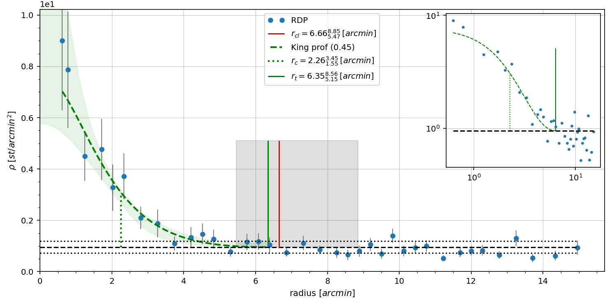

**UBC_246**
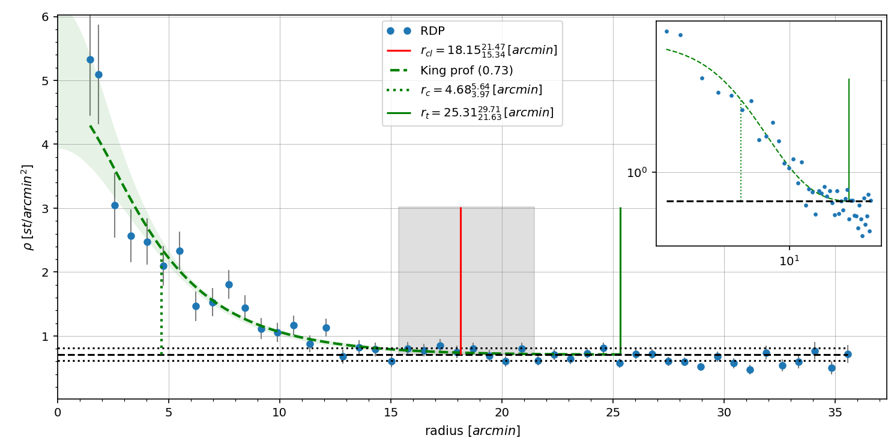

**UBC_482**
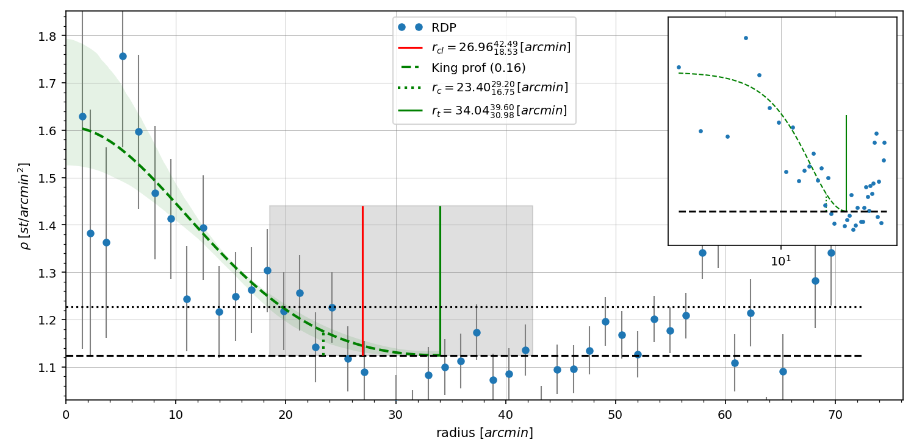


## Membership

The `pyUPMASK`  method was employed for NGC2659 and UBC_246

```
xy_coords    = GLON GLAT
data         = pmRA  pmDE Plx
OL_runs      = 25
PCAflag      = False
GUMM_flag    = False
KDEP_flag    = False
IL_runs    = 100
N_membs    = 25
N_cl_max   = 1000
clust_method = GaussianMixture
```

For UBC_482 `pyUPMASK` failed so we used the `fastMP` method.


These are the three clusters with a membership probability cut at `P>0.5`

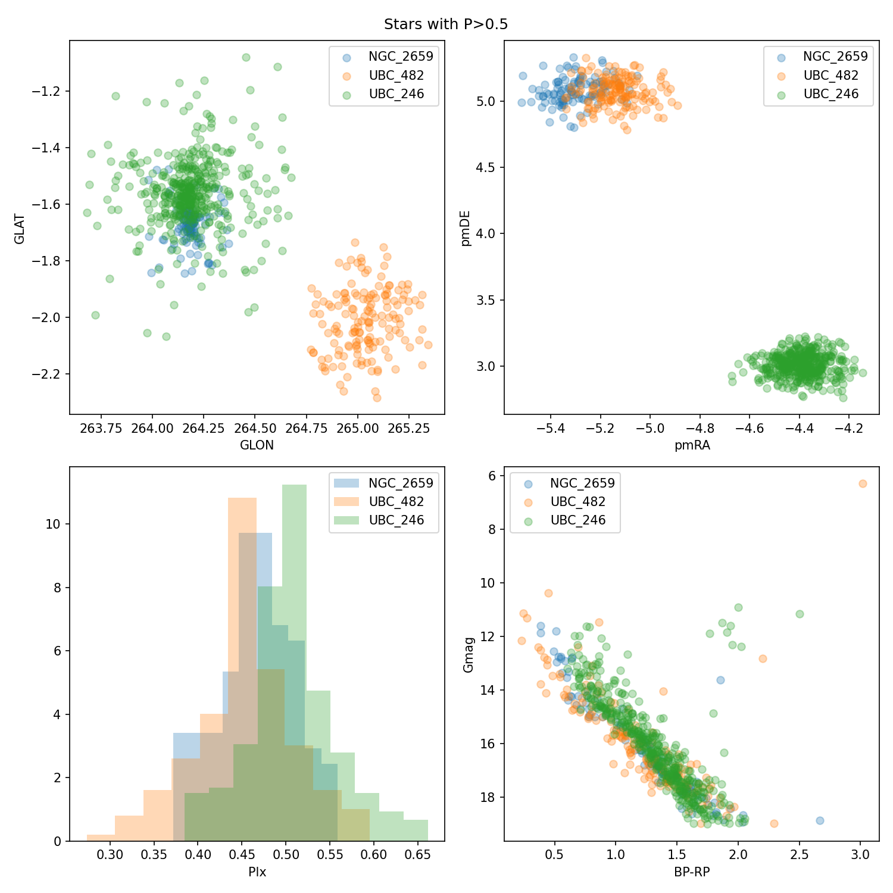


## Parallax distances

Selecting stars with `P>0.5` we estimate the median parallax (and 16th, 84th
percentiles) for different cuts in `Gmag`, and the distance modulus
distribution.


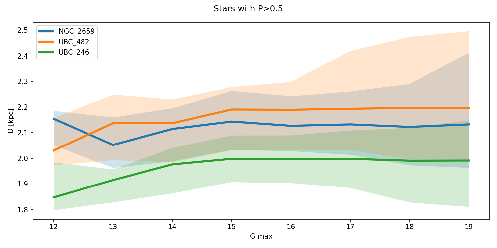


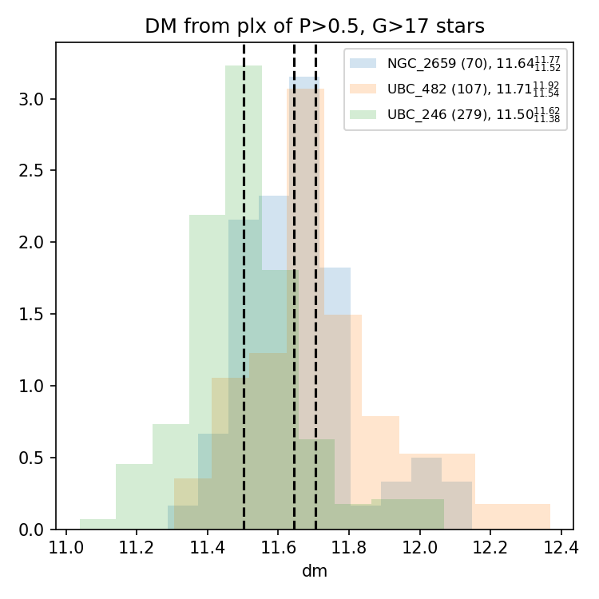


## ASteCA

The radii were set to `max` since a selection based on probabilities was
performed before processing.

```
#   name       c_x      c_y       field_dens   clust_radius    f_regs
S0  UBC_482    265.118  -1.976    a            max             0
S0  UBC_246    264.178  -1.573    a            max             0
S0  NGC2659    264.182  -1.671    a            max             0
```

Ranges for the first two runs. Distance ranges are taken from the parallax
range of the members, age ranges are taken from CG20.

```
#   name       z        log(age)    Beta   Av    DR  Rv    d_m
R5  UBC_246   min/max   8.0/9.0     0.15    0/4    0   3.1   11.38/11.62
R5  UBC_482   min/max   6.93/7.93   0.15    0/4    0   3.1   11.54/11.92
R5  NGC_2659  min/max   7.14/8.14   0.15    0/4    0   3.1   11.52/11.77
```

Priors are all uniform except the distance modulus, taken from the parallax
distribution of `P>0.5, G>17 mag` members.

```
#      name      z    log(age)    Beta     Av      DR      Rv    d_m
B2  UBC_482      u           u       u      u       u       u     g/11.71/.2
B2  UBC_246      u           u       u      u       u       u     g/11.50/.16
B2  NGC_2659     u           u       u      u       u       u     g/11.64/.16
```


### 1st run

For this run the membership probability cut was done at `P>0.5`

**NGC2659**
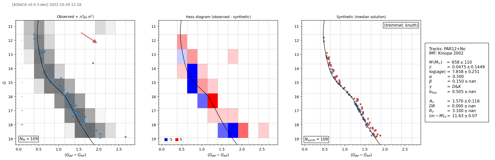


**UBC_246**
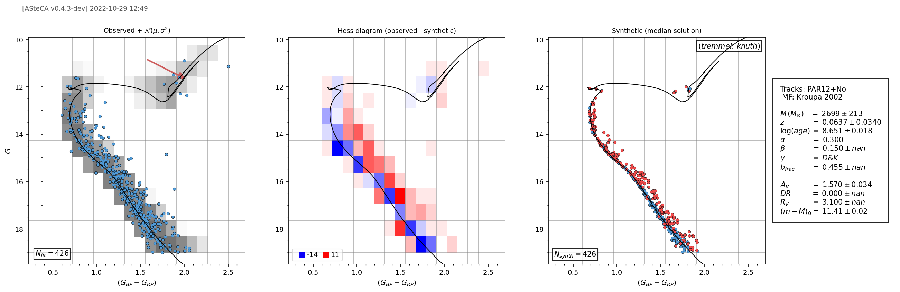


**UBC_482**
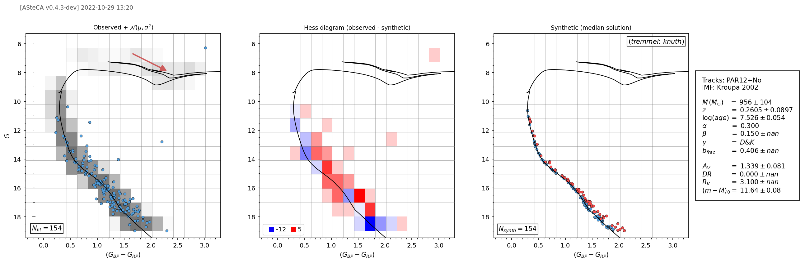


### 2nd run

For this run the membership probability cut was done at `P>0.7`


**NGC2659**
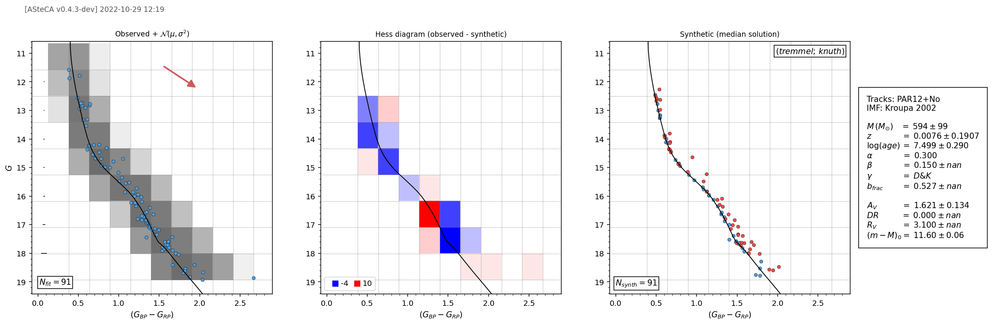


**UBC_246**
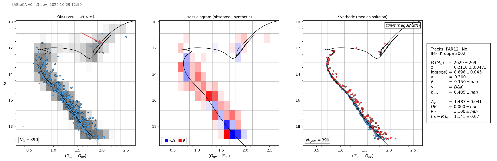


**UBC_482**
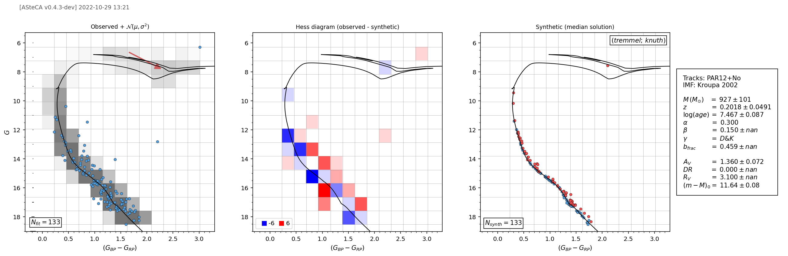


## Fundamental parameters

| **NAME**       | **FeH** | **std** | **lage** | **std** | **bf** | **std** | **Av** | **std** | **dm** | **std** |
| -------------- | ------- | ------- | -------- | ------- | ------ | ------- | ------ | ------- | ------ | ------- |
| p05/NGC\_2659  | 0.048   | 0.145  | 7.86   | 0.25   | 0.50   | 0.03  | 1.57  | 0.12  | 11.63  | 0.07   |
| p07/NGC\_2659  | 0.008   | 0.191  | 7.50   | 0.29   | 0.53   | 0.03  | 1.62  | 0.13  | 11.60  | 0.06   |
| CG20/NGC\_2659 | \--     | \--    | 7.64   | \--    | \--    | \--   | 1.21  | \--   | 11.61  | \--    |
| p05/UBC\_246   | 0.064   | 0.034  | 8.65   | 0.02   | 0.46   | 0.01  | 1.57  | 0.03  | 11.41  | 0.02   |
| p07/UBC\_246   | 0.211   | 0.047  | 8.70   | 0.05   | 0.41   | 0.02  | 1.49  | 0.04  | 11.41  | 0.07   |
| CG20/UBC\_246  | \--     | \--    | 8.50   | \--    | \--    | \--   | 1.59  | \--   | 11.63  | \--    |
| p05/UBC\_482   | 0.261   | 0.090  | 7.53   | 0.05   | 0.41   | 0.02  | 1.34  | 0.08  | 11.64  | 0.08   |
| p07/UBC\_482   | 0.202   | 0.049  | 7.47   | 0.09   | 0.46   | 0.03  | 1.36  | 0.07  | 11.64  | 0.08   |
| CG20/UBC\_482  | \--     | \--    | 7.43   | \--    | \--    | \--   | 0.88  | \--   | 11.76  | \--    |

CG20 distances from their parallax estimates

| **CG20**  | **plx** | **d\_pc** | **dm** |
| --------- | ------- | --------- | ------ |
| NGC\_2659 | 0.452   | 2212      | 11.72  |
| UBC\_246  | 0.485   | 2062      | 11.57  |
| UBC\_482  | 0.446   | 2242      | 11.75  |